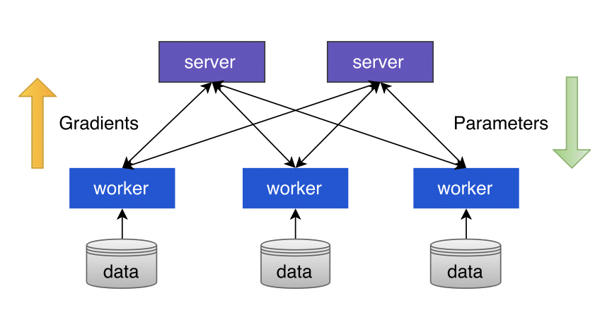
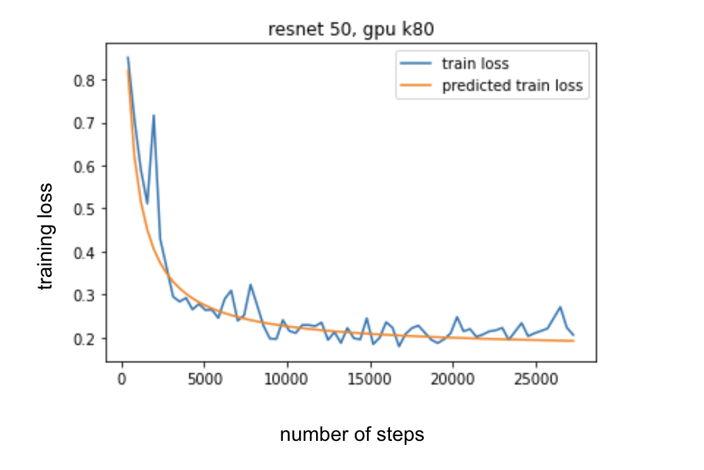
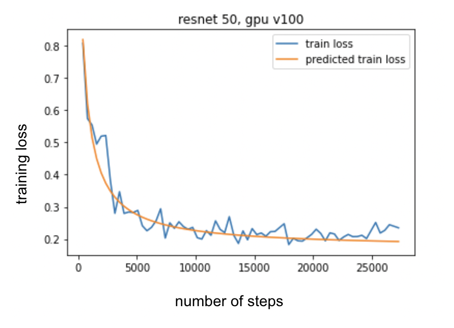
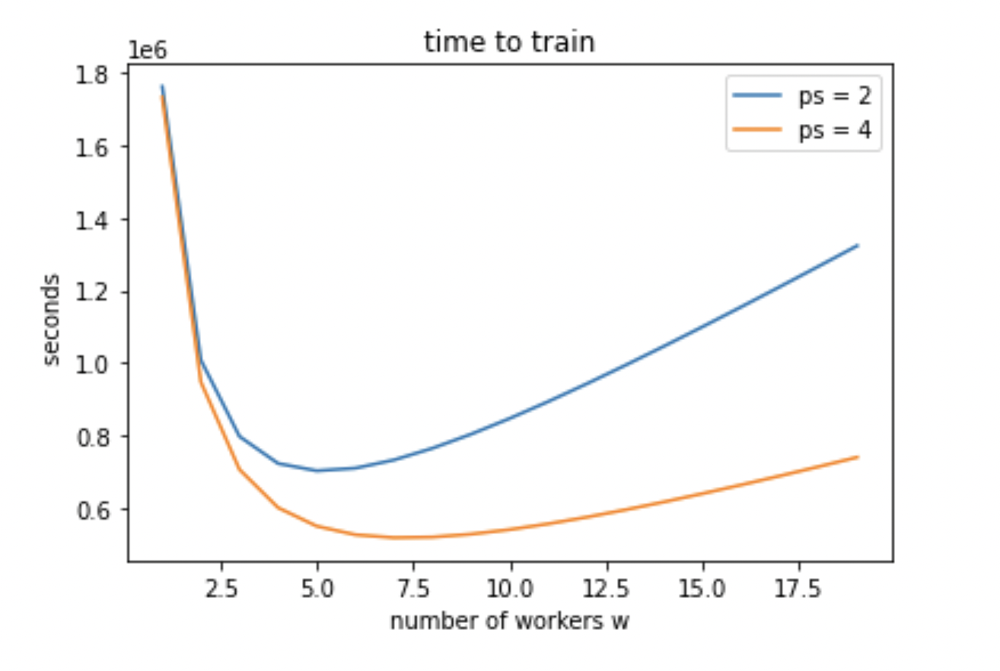

# Resource Scheduling for Deep Learning Clusters

Problem: Training time varies a lot
Task: Estimate how much time it will take to finish distributed training based on resource configurations like gpu type and number of workers.

We **trained** Resnet models with different number of layers (18, 20, 32, 44, 56) each with 3 different GPU types (K80, P100, V100).
Data: CIFAR10.

We determine relationship between resource configuration and training time convergence following Optimus scheduler, as proposed by Peng et al. This involves two steps:

1. Model training loss as a number of steps
2. Model training speed (steps/time) as a function of resources (number of workers and parameter servers)

## Background

Most distributed ML/DL frameworks use parameter server (PS) architecture:
- model partitioned among multiple parameter servers
- training data split among workers

Each training step looks something liket this:
- each worker computes gradients locally using its data
- worker pushes gradients to parameter server that maintains model parameters
- parameter sever updates model param using say SGD or other algorithm
- server sends the updated parameter back to worker
- worker does the next stp.

## Training loss model
We trained Resnet models with different number of layers (18, 20, 32, 44, 56) each with 3 different GPU types (K80, P100, V100).
Data: CIFAR10

We create a model for predicting training loss based on number of layers/steps and GPU type.

The following curves compare the predicted training loss versus actual loss when training resnet-50 in k80 and v100 gpu.

## Time to accuracy 

For Resnet50, we model training time based on number of workers and parameter servers
We find that there's an optimal number of workers, around 4, after which time to train increaes. 
